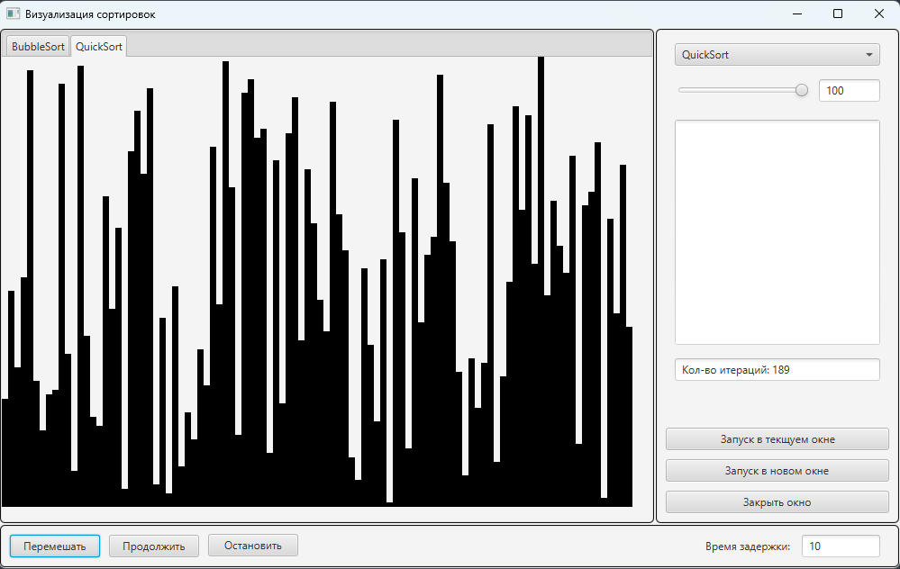
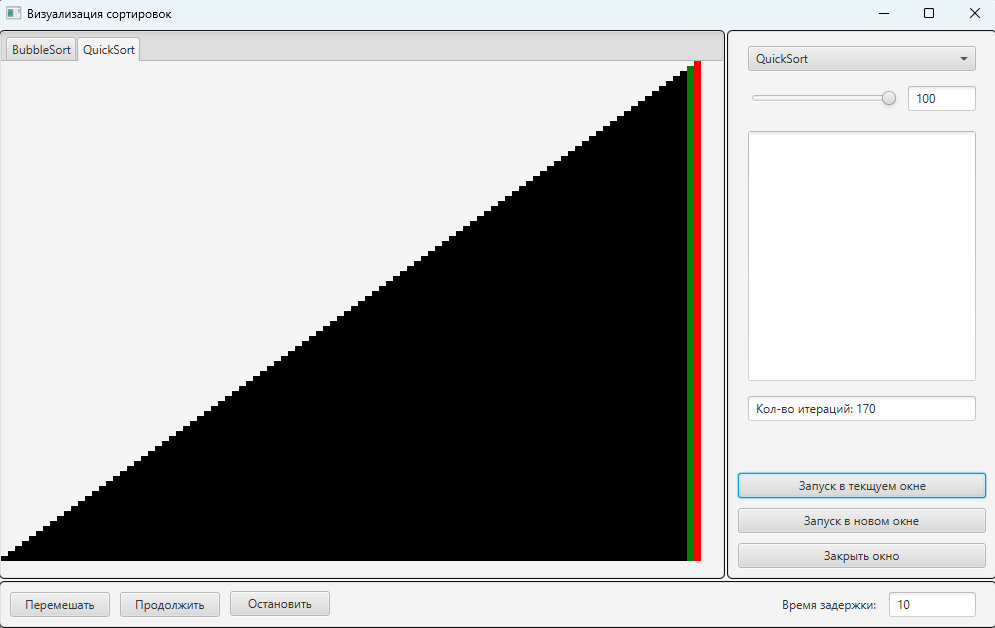

# Visualization of sorts

SortViz is an interactive application designed for visualizing various sorting algorithms. This tool allows users to visually explore and comprehend different sorting algorithms in real-time. Users can observe the step-by-step sorting process, witnessing each element of the input array move to its rightful place according to the logic of the chosen algorithm.

Choose from a diverse range of algorithms, including Bubble Sort, Insertion Sort, Quick Sort, and many others. Watch as they operate on different input data, gaining insights into their inner workings. The program's interface is intuitive: simply select an algorithm, input or generate data, and click 'Start' to witness the sorting process unfold before your eyes.

This program not only promotes an understanding of how sorting algorithms function but also enables users to compare their performance on various datasets. Immerse yourself in the world of sorting algorithms and enhance your programming experience through this engaging visual representation!

# initial data set 

#

